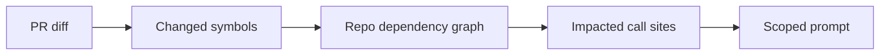

## Context

Ask an LLM to review a diff and you get plausible but shallow feedback: it can't see
that a renamed function is called in eleven other files, or that your team forbids a
pattern the diff happens to use. The missing ingredient is *context* — but naively
stuffing the whole repo into the prompt is expensive and noisy.

## The core idea: scope, don't dump

PRism assembles context bounded to what a change actually affects, in two layers.

### 1. Structural scope via dependency graph

A Tree-sitter pass builds a repo-wide symbol and dependency graph. For a given PR, it
resolves the *impacted set*: the changed symbols plus their call sites elsewhere in the
repo.

### 2. Semantic scope via retrieval

Internal style-guide rules live in a Qdrant vector store. Retrieval is scoped to the
change, so only the relevant rules ("we don't use raw SQL in handlers") enter the
prompt — not the entire handbook.

## Making it fast: cache by commit SHA

Rebuilding the AST and symbol map on every webhook is wasteful because most of a repo is
unchanged between commits. PRism caches ASTs and symbol maps in Redis **keyed by commit
SHA**, so unchanged files are never re-parsed.

## Outcome

The result is review feedback that reads like it came from someone who knows the
codebase: specific to the impacted symbols, aware of internal rules, and cheap enough to
run on every PR. Quality is kept honest with a precision/recall pipeline over known-bad
PRs.
