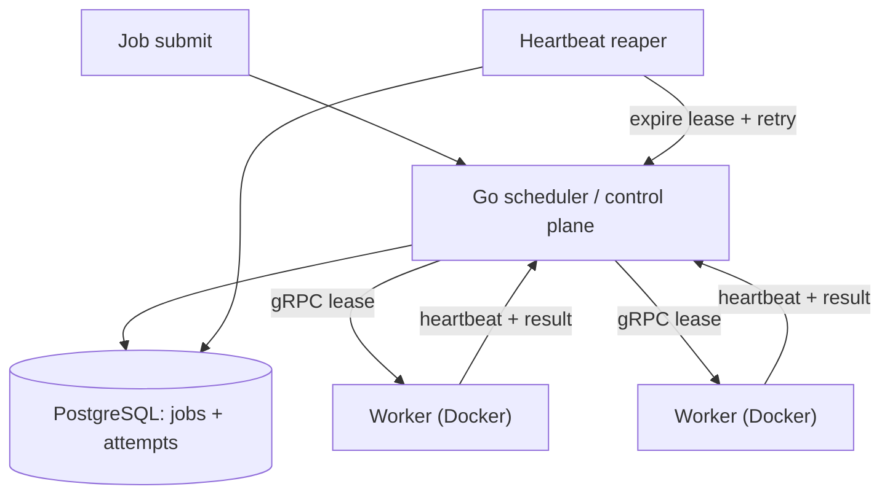

```mermaid
flowchart TD
  Client["Job submit"] --> Scheduler["Go scheduler / control plane"]
  Scheduler --> DB[("PostgreSQL: jobs + attempts")]
  Scheduler -->|"gRPC lease"| Worker1["Worker (Docker)"]
  Scheduler -->|"gRPC lease"| Worker2["Worker (Docker)"]
  Worker1 -->|"heartbeat + result"| Scheduler
  Worker2 -->|"heartbeat + result"| Scheduler
  Reaper["Heartbeat reaper"] --> DB
  Reaper -->|"expire lease + retry"| Scheduler
```
