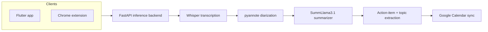

```mermaid
flowchart LR
  subgraph clients [Clients]
    Mobile["Flutter app"]
    Ext["Chrome extension"]
  end
  clients --> API["FastAPI inference backend"]
  API --> ASR["Whisper transcription"]
  ASR --> Diar["pyannote diarization"]
  Diar --> Sum["SummLlama3.1 summarizer"]
  Sum --> Items["Action-item + topic extraction"]
  Items --> Cal["Google Calendar sync"]
```
