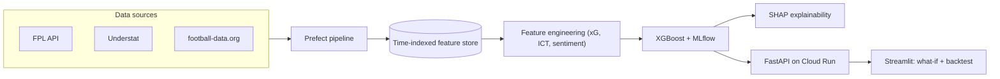

```mermaid
flowchart LR
  subgraph sources [Data sources]
    FPL["FPL API"]
    US["Understat"]
    FD["football-data.org"]
  end
  sources --> Prefect["Prefect pipeline"]
  Prefect --> FS[("Time-indexed feature store")]
  FS --> Feat["Feature engineering (xG, ICT, sentiment)"]
  Feat --> Model["XGBoost + MLflow"]
  Model --> SHAP["SHAP explainability"]
  Model --> API["FastAPI on Cloud Run"]
  API --> UI["Streamlit: what-if + backtest"]
```
