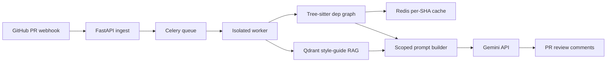

```mermaid
flowchart LR
  GH["GitHub PR webhook"] --> API["FastAPI ingest"]
  API --> Q["Celery queue"]
  Q --> W["Isolated worker"]
  W --> AST["Tree-sitter dep graph"]
  AST --> Cache["Redis per-SHA cache"]
  W --> RAG["Qdrant style-guide RAG"]
  AST --> Prompt["Scoped prompt builder"]
  RAG --> Prompt
  Prompt --> LLM["Gemini API"]
  LLM --> Review["PR review comments"]
```
