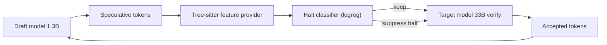

```mermaid
flowchart LR
  Draft["Draft model 1.3B"] --> Tokens["Speculative tokens"]
  Tokens --> Parser["Tree-sitter feature provider"]
  Parser --> Clf["Halt classifier (logreg)"]
  Clf -->|"keep"| Verify["Target model 33B verify"]
  Clf -->|"suppress halt"| Verify
  Verify --> Accept["Accepted tokens"]
  Accept --> Draft
```
