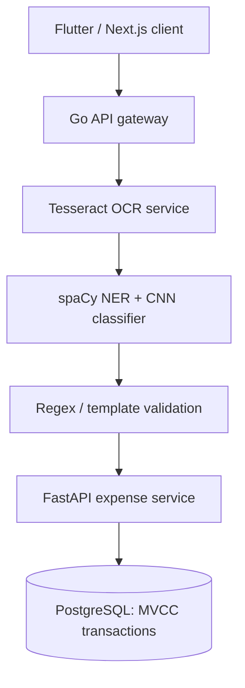

```mermaid
flowchart TD
  App["Flutter / Next.js client"] --> GW["Go API gateway"]
  GW --> OCR["Tesseract OCR service"]
  OCR --> NER["spaCy NER + CNN classifier"]
  NER --> Val["Regex / template validation"]
  Val --> Ledger["FastAPI expense service"]
  Ledger --> DB[("PostgreSQL: MVCC transactions")]
```
